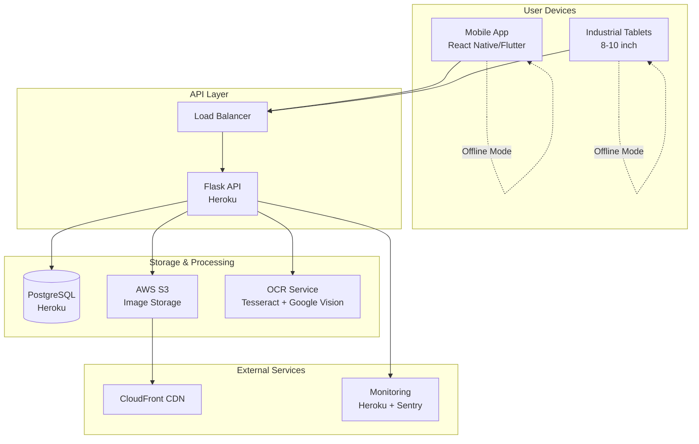
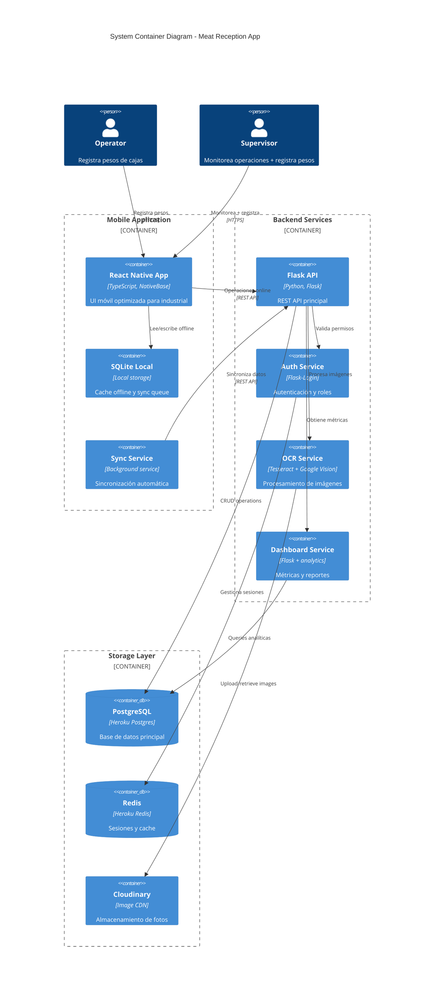
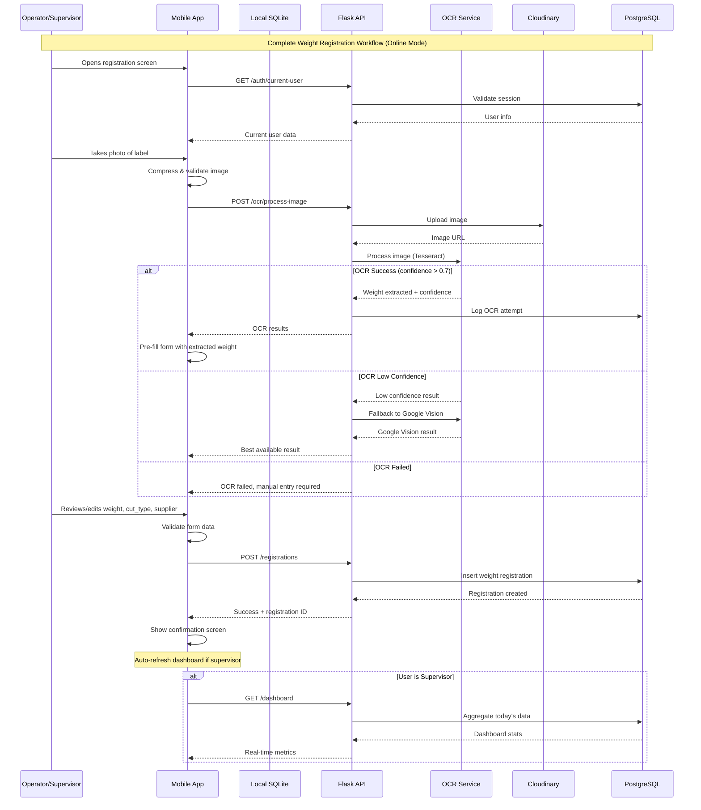
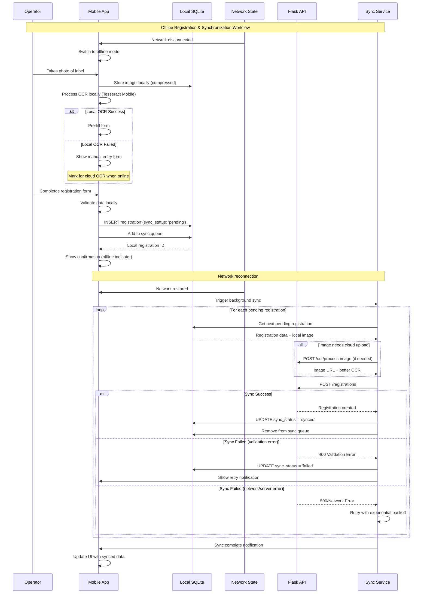
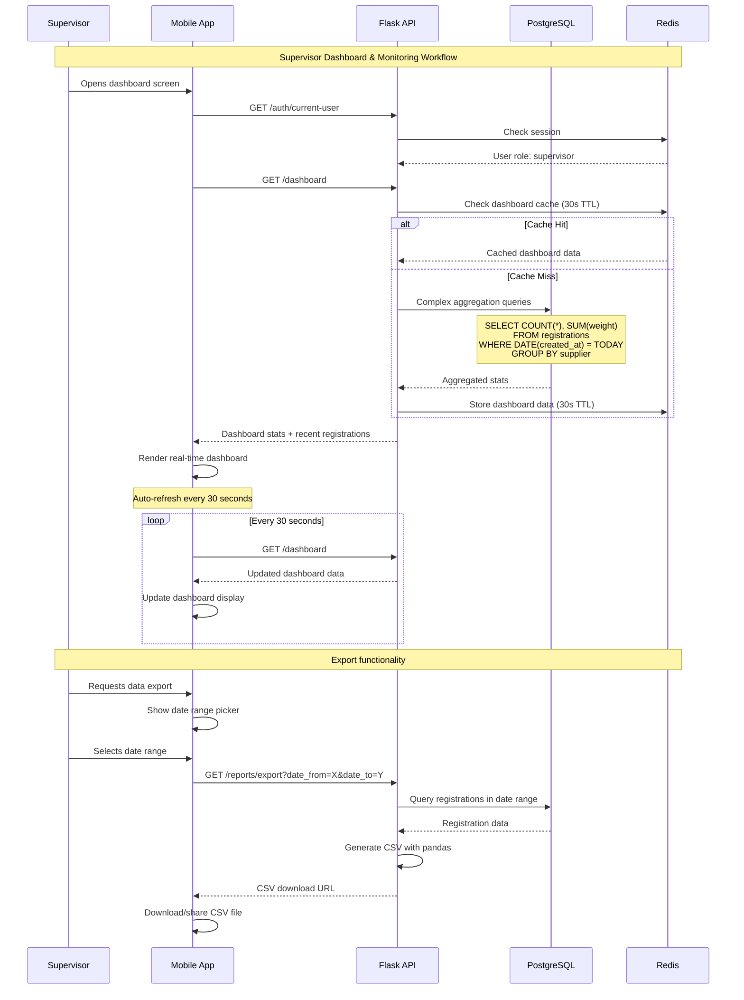
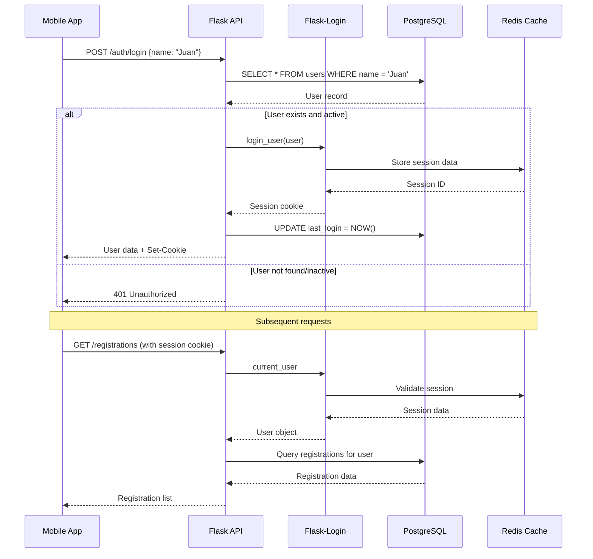
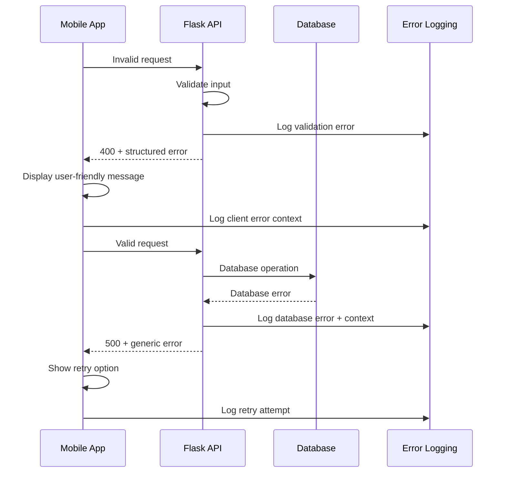

# Aplicación de Registro de Pesos para Recepción de Carnes - Fullstack Architecture Document

## Introduction

This document outlines the complete fullstack architecture for **Aplicación de Registro de Pesos para Recepción de Carnes**, including backend systems, frontend implementation, and their integration. It serves as the single source of truth for AI-driven development, ensuring consistency across the entire technology stack.

This unified approach combines what would traditionally be separate backend and frontend architecture documents, streamlining the development process for this industrial mobile application where real-time data processing, offline capabilities, and robust integration are critical.

### Starter Template or Existing Project

**N/A - Greenfield project**

This is a new greenfield project that will leverage existing infrastructure (PostgreSQL/Heroku) but requires complete application development. Based on the PRD requirements for cross-platform mobile development with Flask backend, we'll recommend appropriate starter templates during the high-level architecture phase.

### Change Log

| Date | Version | Description | Author |
|------|---------|-------------|---------|
| 2025-08-20 | 1.0 | Initial fullstack architecture document | Winston (Architect) |

## High Level Architecture

### Technical Summary
This fullstack application follows a **Mobile-First Industrial Architecture** with Flask backend API, cross-platform mobile frontend, and hybrid offline/online data synchronization. The system leverages existing Heroku/PostgreSQL infrastructure while adding S3 storage for image management and OCR processing capabilities. The architecture prioritizes industrial robustness with offline-first design, optimized for gloved operation and intermittent connectivity typical in meat processing environments.

### Platform and Infrastructure Choice

Based on PRD requirements and existing infrastructure, I recommend **Heroku + AWS hybrid** approach:

**Option 1: Heroku + AWS (Recommended)**
- **Pros**: Leverages existing Heroku/PostgreSQL setup, mature Flask deployment, AWS S3 for reliable image storage, cost-effective for current scale
- **Cons**: Vendor lock-in across two platforms, manual scaling decisions required

**Option 2: Full AWS Stack**  
- **Pros**: Unified platform, advanced scaling options, comprehensive monitoring
- **Cons**: Migration effort from existing Heroku setup, steeper learning curve, potentially higher costs for current scale

**Option 3: Vercel + Supabase**
- **Pros**: Modern developer experience, integrated auth and storage
- **Cons**: Requires migration from PostgreSQL/Heroku, Flask less optimal for Vercel

**Recommendation: Heroku + AWS hybrid** - maintains existing investments while adding robust image storage and processing capabilities.

**Platform:** Heroku + AWS  
**Key Services:** Heroku (Flask API, PostgreSQL), AWS S3 (image storage), AWS CloudFront (CDN)  
**Deployment Host and Regions:** Heroku US East, AWS US East-1

### Repository Structure
**Structure:** Monorepo with clear mobile/backend separation  
**Monorepo Tool:** npm workspaces (lightweight, sufficient for 2-app structure)  
**Package Organization:** apps/ (mobile, api), packages/ (shared types, utilities)

### High Level Architecture Diagram



### Architectural Patterns
- **Mobile-First Offline Architecture:** SQLite local storage with background sync - _Rationale:_ Essential for industrial environment with intermittent connectivity
- **API-First Backend Design:** RESTful Flask API with clear versioning - _Rationale:_ Enables mobile app development and future integrations
- **Event-Driven Sync Pattern:** Queue-based synchronization for offline data - _Rationale:_ Ensures data consistency without blocking user workflow
- **Multi-Modal Input Processing:** OCR + manual input with validation layers - _Rationale:_ Balances automation efficiency with accuracy requirements
- **Role-Based UI Adaptation:** Dynamic interface based on user permissions - _Rationale:_ Single app supporting operator and supervisor workflows

## Tech Stack

Esta es la selección tecnológica DEFINITIVA para todo el proyecto. Todas las decisiones de desarrollo deben usar exactamente estas versiones.

### Technology Stack Table

| Category | Technology | Version | Purpose | Rationale |
|----------|------------|---------|---------|-----------|
| **Frontend Language** | TypeScript | 5.x | Type-safe mobile development | Industrial apps require reliability; TypeScript prevents runtime errors common in JavaScript |
| **Frontend Framework** | React Native | 0.72.x | Cross-platform mobile app | Mature ecosystem, excellent for camera/offline features, team familiarity, cost-effective vs native |
| **UI Component Library** | NativeBase | 3.4.x | Industrial-optimized mobile UI | Large touch targets, accessibility, consistent styling for industrial use |
| **State Management** | Zustand | 4.x | Simple mobile state management | Lightweight vs Redux, perfect for offline sync patterns, minimal boilerplate |
| **Backend Language** | Python | 3.11+ | API development | Leverages existing team expertise, excellent OCR libraries, Heroku optimization |
| **Backend Framework** | Flask | 2.3.x | RESTful API server | Lightweight, mature Heroku deployment, perfect for mobile API needs |
| **API Style** | REST | - | Mobile-optimized endpoints | Simple, cacheable, excellent offline sync support vs GraphQL complexity |
| **Database** | PostgreSQL | 15.x | Primary data storage | Existing Heroku infrastructure, ACID compliance for critical weight data |
| **Cache** | Redis | 7.x | Session & API caching | Heroku Redis addon, improves API response times, session storage |
| **File Storage** | Cloudinary | - | Image storage & processing | Heroku addon, automatic image optimization, CDN included, cost-effective |
| **Authentication** | Flask-Login | 0.6.x | Simple session management | Role-based access, session persistence, no OAuth complexity for internal use |
| **Frontend Testing** | Jest + React Native Testing Library | 29.x / 12.x | Component & integration testing | Standard RN testing, snapshot testing, component isolation |
| **Backend Testing** | pytest + Flask-Testing | 7.x / 0.8.x | API & unit testing | Python standard, excellent Flask integration, mocking capabilities |
| **E2E Testing** | Detox | 20.x | Mobile end-to-end testing | React Native specialty, real device testing, offline scenario testing |
| **Build Tool** | Metro | 0.76.x | React Native bundler | Default RN bundler, optimized for mobile deployment |
| **Bundler** | Webpack | 5.x | Asset bundling | Metro integration, code splitting for mobile optimization |
| **IaC Tool** | None | - | Manual Heroku config | Simple deployment doesn't justify IaC complexity, Heroku CLI sufficient |
| **CI/CD** | GitHub Actions | - | Automated testing & deployment | Free for public repos, excellent Heroku integration, mobile build support |
| **Monitoring** | Sentry | - | Error tracking & performance | Heroku addon, mobile SDK, essential for offline error tracking |
| **Logging** | Python Logging + Heroku Logs | - | Application monitoring | Built-in Flask logging, Heroku log aggregation, cost-effective |
| **CSS Framework** | Styled Components | 6.x | Component styling | React Native compatibility, theme support, maintainable styles |

## Data Models

Basándome en los requisitos del PRD, defino los modelos de datos centrales que serán compartidos entre frontend y backend para el sistema de registro de pesos:

### User

**Purpose:** Representa operadores y supervisores que utilizan el sistema, habilitando autenticación y trazabilidad de registros.

**Key Attributes:**
- id: string (UUID) - Identificador único del usuario
- name: string - Nombre completo del operador/supervisor
- role: 'operator' | 'supervisor' - Rol que determina permisos de acceso
- active: boolean - Estado activo/inactivo del usuario
- created_at: Date - Fecha de creación del usuario
- last_login: Date | null - Último acceso al sistema

#### TypeScript Interface
```typescript
interface User {
  id: string;
  name: string;
  role: 'operator' | 'supervisor';
  active: boolean;
  created_at: Date;
  last_login: Date | null;
}
```

#### Relationships
- One-to-many with WeightRegistration (un usuario puede crear múltiples registros)

### WeightRegistration

**Purpose:** Modelo central que almacena cada registro de peso de cajas de carnes con trazabilidad completa desde recepción.

**Key Attributes:**
- id: string (UUID) - Identificador único del registro
- weight: number - Peso de la caja en kilogramos
- cut_type: 'jamón' | 'chuleta' - Tipo de corte de carne
- supplier: string - Nombre del proveedor de la carne
- photo_url: string | null - URL de la foto de la etiqueta
- ocr_confidence: number | null - Nivel de confianza del OCR (0-1)
- sync_status: 'synced' | 'pending' | 'failed' - Estado de sincronización offline
- registered_by: string - ID del usuario que realizó el registro
- created_at: Date - Timestamp del registro
- updated_at: Date - Última modificación

#### TypeScript Interface
```typescript
interface WeightRegistration {
  id: string;
  weight: number;
  cut_type: 'jamón' | 'chuleta';
  supplier: string;
  photo_url: string | null;
  ocr_confidence: number | null;
  sync_status: 'synced' | 'pending' | 'failed';
  registered_by: string;
  created_at: Date;
  updated_at: Date;
}
```

#### Relationships
- Many-to-one with User (múltiples registros por usuario)
- One-to-many with OCRProcessingLog (un registro puede tener múltiples intentos OCR)

### OCRProcessingLog

**Purpose:** Registro de intentos de procesamiento OCR para análisis de precisión y troubleshooting.

**Key Attributes:**
- id: string (UUID) - Identificador único del log
- registration_id: string - ID del registro asociado
- extracted_text: string - Texto completo extraído por OCR
- confidence_score: number - Puntuación de confianza (0-1)
- processing_time_ms: number - Tiempo de procesamiento en milisegundos
- ocr_engine: 'tesseract' | 'google_vision' - Motor OCR utilizado
- created_at: Date - Timestamp del procesamiento

#### TypeScript Interface
```typescript
interface OCRProcessingLog {
  id: string;
  registration_id: string;
  extracted_text: string;
  confidence_score: number;
  processing_time_ms: number;
  ocr_engine: 'tesseract' | 'google_vision';
  created_at: Date;
}
```

#### Relationships
- Many-to-one with WeightRegistration (múltiples logs por registro)

## API Specification

Basándome en el estilo REST seleccionado en el Tech Stack, defino la especificación OpenAPI 3.0 completa para la API Flask:

### REST API Specification

```yaml
openapi: 3.0.0
info:
  title: Meat Reception Weight Registration API
  version: 1.0.0
  description: API para el registro de pesos de cajas de carnes en recepción industrial
servers:
  - url: https://meat-reception-api.herokuapp.com/api/v1
    description: Production server
  - url: https://meat-reception-staging.herokuapp.com/api/v1
    description: Staging server

components:
  schemas:
    User:
      type: object
      properties:
        id:
          type: string
          format: uuid
        name:
          type: string
          example: "Juan Pérez"
        role:
          type: string
          enum: [operator, supervisor]
        active:
          type: boolean
        created_at:
          type: string
          format: date-time
        last_login:
          type: string
          format: date-time
          nullable: true

    WeightRegistration:
      type: object
      properties:
        id:
          type: string
          format: uuid
        weight:
          type: number
          minimum: 5
          maximum: 50
          example: 15.5
        cut_type:
          type: string
          enum: [jamón, chuleta]
        supplier:
          type: string
          example: "Proveedor Cárnico SA"
        photo_url:
          type: string
          format: uri
          nullable: true
        ocr_confidence:
          type: number
          minimum: 0
          maximum: 1
          nullable: true
        sync_status:
          type: string
          enum: [synced, pending, failed]
        registered_by:
          type: string
          format: uuid
        created_at:
          type: string
          format: date-time
        updated_at:
          type: string
          format: date-time

    CreateRegistrationRequest:
      type: object
      required: [weight, cut_type, supplier]
      properties:
        weight:
          type: number
          minimum: 5
          maximum: 50
        cut_type:
          type: string
          enum: [jamón, chuleta]
        supplier:
          type: string
        photo_url:
          type: string
          format: uri
          nullable: true
        ocr_confidence:
          type: number
          minimum: 0
          maximum: 1
          nullable: true

    LoginRequest:
      type: object
      required: [name]
      properties:
        name:
          type: string
          example: "Juan Pérez"

    DashboardStats:
      type: object
      properties:
        total_boxes_today:
          type: integer
        total_weight_today:
          type: number
        registrations_by_supplier:
          type: array
          items:
            type: object
            properties:
              supplier:
                type: string
              count:
                type: integer
              total_weight:
                type: number
        recent_registrations:
          type: array
          items:
            $ref: '#/components/schemas/WeightRegistration'

    ErrorResponse:
      type: object
      properties:
        error:
          type: object
          properties:
            code:
              type: string
            message:
              type: string
            details:
              type: object
            timestamp:
              type: string
              format: date-time
            requestId:
              type: string

  securitySchemes:
    sessionAuth:
      type: apiKey
      in: cookie
      name: session

paths:
  /health:
    get:
      summary: Health check endpoint
      responses:
        '200':
          description: System is operational
          content:
            application/json:
              schema:
                type: object
                properties:
                  status:
                    type: string
                    example: "healthy"
                  timestamp:
                    type: string
                    format: date-time
                  database_connected:
                    type: boolean

  /auth/login:
    post:
      summary: Authenticate user
      requestBody:
        required: true
        content:
          application/json:
            schema:
              $ref: '#/components/schemas/LoginRequest'
      responses:
        '200':
          description: Login successful
          content:
            application/json:
              schema:
                $ref: '#/components/schemas/User'
        '401':
          description: Invalid credentials
          content:
            application/json:
              schema:
                $ref: '#/components/schemas/ErrorResponse'

  /auth/logout:
    post:
      summary: Logout user
      security:
        - sessionAuth: []
      responses:
        '200':
          description: Logout successful

  /auth/current-user:
    get:
      summary: Get current authenticated user
      security:
        - sessionAuth: []
      responses:
        '200':
          description: Current user info
          content:
            application/json:
              schema:
                $ref: '#/components/schemas/User'
        '401':
          description: Not authenticated

  /registrations:
    get:
      summary: List weight registrations
      security:
        - sessionAuth: []
      parameters:
        - name: page
          in: query
          schema:
            type: integer
            default: 1
        - name: limit
          in: query
          schema:
            type: integer
            default: 20
            maximum: 100
        - name: supplier
          in: query
          schema:
            type: string
        - name: cut_type
          in: query
          schema:
            type: string
            enum: [jamón, chuleta]
        - name: date_from
          in: query
          schema:
            type: string
            format: date
        - name: date_to
          in: query
          schema:
            type: string
            format: date
      responses:
        '200':
          description: List of registrations
          content:
            application/json:
              schema:
                type: object
                properties:
                  registrations:
                    type: array
                    items:
                      $ref: '#/components/schemas/WeightRegistration'
                  total_count:
                    type: integer
                  total_weight:
                    type: number
                  registrations_by_supplier:
                    type: array
                    items:
                      type: object
                      properties:
                        supplier:
                          type: string
                        count:
                          type: integer
                        total_weight:
                          type: number
                  page:
                    type: integer
                  limit:
                    type: integer
                  has_next:
                    type: boolean
                  has_prev:
                    type: boolean

    post:
      summary: Create new weight registration
      security:
        - sessionAuth: []
      requestBody:
        required: true
        content:
          application/json:
            schema:
              $ref: '#/components/schemas/CreateRegistrationRequest'
      responses:
        '201':
          description: Registration created
          content:
            application/json:
              schema:
                $ref: '#/components/schemas/WeightRegistration'
        '400':
          description: Validation error
          content:
            application/json:
              schema:
                $ref: '#/components/schemas/ErrorResponse'

  /registrations/today:
    get:
      summary: Get today's registrations
      security:
        - sessionAuth: []
      responses:
        '200':
          description: Today's registrations
          content:
            application/json:
              schema:
                type: object
                properties:
                  registrations:
                    type: array
                    items:
                      $ref: '#/components/schemas/WeightRegistration'
                  total_count:
                    type: integer
                  total_weight:
                    type: number
                  registrations_by_supplier:
                    type: array
                    items:
                      type: object
                      properties:
                        supplier:
                          type: string
                        count:
                          type: integer
                        total_weight:
                          type: number
                  date:
                    type: string
                    format: date

  /registrations/{id}:
    get:
      summary: Get registration by ID
      security:
        - sessionAuth: []
      parameters:
        - name: id
          in: path
          required: true
          schema:
            type: string
            format: uuid
      responses:
        '200':
          description: Registration details
          content:
            application/json:
              schema:
                $ref: '#/components/schemas/WeightRegistration'
        '404':
          description: Registration not found

  /dashboard:
    get:
      summary: Get supervisor dashboard data
      security:
        - sessionAuth: []
      description: Requires supervisor role
      responses:
        '200':
          description: Dashboard statistics
          content:
            application/json:
              schema:
                $ref: '#/components/schemas/DashboardStats'
        '403':
          description: Insufficient permissions

  /ocr/process-image:
    post:
      summary: Process image for OCR
      security:
        - sessionAuth: []
      requestBody:
        required: true
        content:
          multipart/form-data:
            schema:
              type: object
              properties:
                image:
                  type: string
                  format: binary
      responses:
        '200':
          description: OCR processing completed
          content:
            application/json:
              schema:
                type: object
                properties:
                  extracted_weight:
                    type: number
                    nullable: true
                  confidence:
                    type: number
                    minimum: 0
                    maximum: 1
                  extracted_text:
                    type: string
                  processing_time_ms:
                    type: integer

  /users:
    get:
      summary: List users (supervisors only)
      security:
        - sessionAuth: []
      responses:
        '200':
          description: List of users
          content:
            application/json:
              schema:
                type: array
                items:
                  $ref: '#/components/schemas/User'
        '403':
          description: Insufficient permissions

    post:
      summary: Create new user (supervisors only)
      security:
        - sessionAuth: []
      requestBody:
        required: true
        content:
          application/json:
            schema:
              type: object
              required: [name, role]
              properties:
                name:
                  type: string
                role:
                  type: string
                  enum: [operator, supervisor]
      responses:
        '201':
          description: User created
          content:
            application/json:
              schema:
                $ref: '#/components/schemas/User'
```

## Components

Basándome en los patrones arquitectónicos, tech stack y modelos de datos definidos, identifico los componentes lógicos principales del sistema fullstack:

### Mobile Application (Frontend)

**Responsibility:** Interfaz de usuario móvil optimizada para uso industrial con guantes, captura de fotos, modo offline, y sincronización automática.

**Key Interfaces:**
- REST API client para comunicación con backend
- SQLite local para almacenamiento offline
- Cámara nativa para captura de etiquetas
- Zustand stores para gestión de estado

**Dependencies:** Flask API, Cloudinary (via API), dispositivo móvil con cámara

**Technology Stack:** React Native 0.72.x, TypeScript 5.x, NativeBase 3.4.x, Zustand 4.x

### Authentication Service (Backend)

**Responsibility:** Gestión de autenticación basada en sesiones, autorización por roles, y mantenimiento de estado de usuario.

**Key Interfaces:**
- POST /auth/login - Autenticación de usuarios
- GET /auth/current-user - Información de sesión actual
- Role-based access control decorators

**Dependencies:** PostgreSQL (users table), Flask-Login, Redis (session storage)

**Technology Stack:** Flask 2.3.x, Flask-Login 0.6.x, PostgreSQL 15.x

### Weight Registration Service (Backend)

**Responsibility:** Lógica de negocio central para crear, validar y almacenar registros de peso con trazabilidad completa.

**Key Interfaces:**
- POST /registrations - Crear nuevo registro
- GET /registrations - Listar con filtros
- Data validation y business rules

**Dependencies:** PostgreSQL (registrations table), Authentication Service, OCR Service

**Technology Stack:** Flask 2.3.x, SQLAlchemy, PostgreSQL 15.x

### OCR Processing Service (Backend)

**Responsibility:** Procesamiento de imágenes para extracción automática de peso usando Tesseract local con fallback a Google Vision.

**Key Interfaces:**
- POST /ocr/process-image - Procesar imagen uploaded
- OCR confidence scoring y logging
- Image preprocessing pipeline

**Dependencies:** Cloudinary (image storage), Tesseract/pytesseract, Google Vision API (fallback)

**Technology Stack:** Python 3.11+, Tesseract, Google Vision API, Cloudinary

### Data Synchronization Service (Frontend)

**Responsibility:** Gestión de modo offline, queue de operaciones pendientes, y sincronización automática cuando se restaura conectividad.

**Key Interfaces:**
- Local SQLite database operations
- Background sync queue management
- Conflict resolution logic

**Dependencies:** SQLite local, REST API client, network state monitoring

**Technology Stack:** React Native SQLite, Zustand persistence, background tasks

### Dashboard & Reporting Service (Backend)

**Responsibility:** Agregación de datos en tiempo real para dashboard supervisor, métricas operativas, y funcionalidades de exportación.

**Key Interfaces:**
- GET /dashboard - Métricas en tiempo real
- GET /reports/export - Exportación CSV
- Aggregation queries optimizadas

**Dependencies:** PostgreSQL (analytical queries), Authentication Service (supervisor role)

**Technology Stack:** Flask 2.3.x, PostgreSQL 15.x, pandas (for exports)

### Component Diagrams



## Core Workflows

Ilustro los flujos críticos del sistema usando diagramas de secuencia que muestran las interacciones entre componentes, incluyendo APIs externas y manejo de errores:







## Frontend Architecture

Defino la arquitectura específica del frontend React Native optimizada para uso industrial:

### Component Architecture

#### Component Organization
```text
src/
├── components/           # Reusable UI components
│   ├── common/          # Generic components (buttons, inputs, etc.)
│   ├── forms/           # Form-specific components
│   ├── camera/          # Camera and photo capture components
│   └── industrial/      # Industrial-specific UI (large buttons, etc.)
├── screens/             # Screen components (full pages)
│   ├── auth/           # Login/authentication screens
│   ├── registration/   # Weight registration flow screens
│   ├── dashboard/      # Dashboard and reporting screens
│   └── settings/       # App settings and user management
├── navigation/          # Navigation configuration
│   ├── AppNavigator.tsx # Main navigation stack
│   ├── AuthNavigator.tsx # Authentication flow
│   └── TabNavigator.tsx # Main app tabs
└── hooks/               # Custom React hooks
    ├── useAuth.ts      # Authentication state
    ├── useSync.ts      # Offline sync management
    ├── useCamera.ts    # Camera functionality
    └── useNetworkStatus.ts # Network connectivity
```

#### Component Template
```typescript
// Industrial component pattern with large touch targets and glove-friendly design
import React from 'react';
import { Box, Button, Text } from 'native-base';
import { TouchableOpacity } from 'react-native';

interface IndustrialButtonProps {
  onPress: () => void;
  title: string;
  variant?: 'primary' | 'secondary' | 'danger';
  disabled?: boolean;
  size?: 'large' | 'xlarge';
}

export const IndustrialButton: React.FC<IndustrialButtonProps> = ({
  onPress,
  title,
  variant = 'primary',
  disabled = false,
  size = 'large'
}) => {
  const minHeight = size === 'xlarge' ? 80 : 60; // Glove-friendly minimum
  
  return (
    <Button
      onPress={onPress}
      disabled={disabled}
      variant={variant}
      size={size}
      minH={minHeight}
      _text={{
        fontSize: size === 'xlarge' ? 'xl' : 'lg',
        fontWeight: 'bold'
      }}
      _pressed={{
        bg: `${variant}.600`
      }}
    >
      {title}
    </Button>
  );
};
```

### State Management Architecture

#### State Structure
```typescript
// Zustand store structure optimized for offline-first architecture
import { create } from 'zustand';
import { persist, createJSONStorage } from 'zustand/middleware';
import AsyncStorage from '@react-native-async-storage/async-storage';

interface AppState {
  // Authentication state
  user: User | null;
  isAuthenticated: boolean;
  
  // Registration state
  registrations: WeightRegistration[];
  pendingSyncRegistrations: WeightRegistration[];
  
  // Network & sync state
  isOnline: boolean;
  syncStatus: 'idle' | 'syncing' | 'error';
  lastSyncTime: Date | null;
  
  // UI state
  currentScreen: string;
  isLoading: boolean;
  error: string | null;
  
  // Actions
  login: (user: User) => void;
  logout: () => void;
  addRegistration: (registration: WeightRegistration) => void;
  markForSync: (registrationId: string) => void;
  updateSyncStatus: (status: 'idle' | 'syncing' | 'error') => void;
  setOnlineStatus: (isOnline: boolean) => void;
}

export const useAppStore = create<AppState>()(
  persist(
    (set, get) => ({
      user: null,
      isAuthenticated: false,
      registrations: [],
      pendingSyncRegistrations: [],
      isOnline: true,
      syncStatus: 'idle',
      lastSyncTime: null,
      currentScreen: 'login',
      isLoading: false,
      error: null,
      
      login: (user) => set({ user, isAuthenticated: true }),
      logout: () => set({ user: null, isAuthenticated: false }),
      
      addRegistration: (registration) => set((state) => ({
        registrations: [...state.registrations, registration],
        pendingSyncRegistrations: state.isOnline 
          ? state.pendingSyncRegistrations 
          : [...state.pendingSyncRegistrations, registration]
      })),
      
      markForSync: (registrationId) => set((state) => ({
        pendingSyncRegistrations: state.pendingSyncRegistrations.filter(
          r => r.id !== registrationId
        )
      })),
      
      updateSyncStatus: (syncStatus) => set({ syncStatus }),
      setOnlineStatus: (isOnline) => set({ isOnline })
    }),
    {
      name: 'meat-reception-storage',
      storage: createJSONStorage(() => AsyncStorage),
      partialize: (state) => ({
        user: state.user,
        registrations: state.registrations,
        pendingSyncRegistrations: state.pendingSyncRegistrations,
        lastSyncTime: state.lastSyncTime
      })
    }
  )
);
```

#### State Management Patterns
- **Offline-first persistence**: All critical state persisted to AsyncStorage for offline resilience
- **Optimistic updates**: UI updates immediately, sync happens in background
- **Separation of concerns**: Auth, data, sync, and UI state clearly separated
- **Immutable updates**: State updates follow immutability patterns for predictable behavior

### Routing Architecture

#### Route Organization
```text
Navigation Structure:
├── AuthNavigator (Stack)
│   ├── LoginScreen
│   └── UserSelectionScreen
└── MainNavigator (Tab)
    ├── RegistrationTab (Stack)
    │   ├── RegistrationHomeScreen
    │   ├── CameraScreen
    │   ├── OCRReviewScreen
    │   ├── ManualEntryScreen
    │   └── ConfirmationScreen
    ├── HistoryTab (Stack)
    │   ├── TodayRegistrationsScreen
    │   ├── RegistrationDetailScreen
    │   └── SearchScreen
    └── DashboardTab (Stack) [Supervisors only]
        ├── DashboardOverviewScreen
        ├── ReportsScreen
        └── UserManagementScreen
```

#### Protected Route Pattern
```typescript
// Role-based navigation with industrial UX considerations
import React from 'react';
import { createBottomTabNavigator } from '@react-navigation/bottom-tabs';
import { Icon } from 'native-base';
import { useAppStore } from '../stores/useAppStore';

const Tab = createBottomTabNavigator();

export const MainTabNavigator: React.FC = () => {
  const user = useAppStore(state => state.user);
  const isSupervisor = user?.role === 'supervisor';
  
  return (
    <Tab.Navigator
      screenOptions={{
        tabBarStyle: {
          height: 80, // Large tab bar for industrial use
          paddingBottom: 10,
        },
        tabBarIconStyle: {
          marginTop: 5,
        },
        tabBarLabelStyle: {
          fontSize: 14,
          fontWeight: 'bold',
        },
      }}
    >
      <Tab.Screen 
        name="Registration" 
        component={RegistrationNavigator}
        options={{
          tabBarIcon: ({ color, size }) => (
            <Icon name="add-circle" size={size + 10} color={color} />
          ),
        }}
      />
      
      <Tab.Screen 
        name="History" 
        component={HistoryNavigator}
        options={{
          tabBarIcon: ({ color, size }) => (
            <Icon name="list" size={size + 10} color={color} />
          ),
        }}
      />
      
      {isSupervisor && (
        <Tab.Screen 
          name="Dashboard" 
          component={DashboardNavigator}
          options={{
            tabBarIcon: ({ color, size }) => (
              <Icon name="analytics" size={size + 10} color={color} />
            ),
          }}
        />
      )}
    </Tab.Navigator>
  );
};
```

### Frontend Services Layer

#### API Client Setup
```typescript
// Centralized API client with offline support and error handling
import axios, { AxiosInstance, AxiosRequestConfig } from 'axios';
import { useAppStore } from '../stores/useAppStore';
import { API_BASE_URL } from '../config/environment';

class ApiClient {
  private client: AxiosInstance;
  
  constructor() {
    this.client = axios.create({
      baseURL: API_BASE_URL,
      timeout: 10000,
      withCredentials: true, // For session cookies
    });
    
    this.setupInterceptors();
  }
  
  private setupInterceptors() {
    // Request interceptor for loading states
    this.client.interceptors.request.use((config) => {
      useAppStore.getState().setLoading(true);
      return config;
    });
    
    // Response interceptor for error handling
    this.client.interceptors.response.use(
      (response) => {
        useAppStore.getState().setLoading(false);
        return response;
      },
      (error) => {
        useAppStore.getState().setLoading(false);
        
        if (error.response?.status === 401) {
          useAppStore.getState().logout();
        }
        
        // Network error - mark as offline
        if (!error.response) {
          useAppStore.getState().setOnlineStatus(false);
        }
        
        return Promise.reject(error);
      }
    );
  }
  
  async get<T>(url: string, config?: AxiosRequestConfig): Promise<T> {
    const response = await this.client.get(url, config);
    return response.data;
  }
  
  async post<T>(url: string, data?: any, config?: AxiosRequestConfig): Promise<T> {
    const response = await this.client.post(url, data, config);
    return response.data;
  }
}

export const apiClient = new ApiClient();
```

#### Service Example
```typescript
// Registration service with offline queue management
import { apiClient } from './apiClient';
import { WeightRegistration, CreateRegistrationRequest } from '../types';
import { useAppStore } from '../stores/useAppStore';
import { v4 as uuidv4 } from 'uuid';

export class RegistrationService {
  async createRegistration(data: CreateRegistrationRequest): Promise<WeightRegistration> {
    const isOnline = useAppStore.getState().isOnline;
    
    if (isOnline) {
      try {
        const registration = await apiClient.post<WeightRegistration>('/registrations', data);
        useAppStore.getState().addRegistration(registration);
        return registration;
      } catch (error) {
        // If API fails, save locally and mark for sync
        return this.saveOfflineRegistration(data);
      }
    } else {
      // Offline mode - save locally
      return this.saveOfflineRegistration(data);
    }
  }
  
  private saveOfflineRegistration(data: CreateRegistrationRequest): WeightRegistration {
    const registration: WeightRegistration = {
      ...data,
      id: uuidv4(),
      sync_status: 'pending',
      registered_by: useAppStore.getState().user!.id,
      created_at: new Date(),
      updated_at: new Date(),
    };
    
    useAppStore.getState().addRegistration(registration);
    return registration;
  }
  
  async getTodayRegistrations(): Promise<WeightRegistration[]> {
    try {
      return await apiClient.get<WeightRegistration[]>('/registrations/today');
    } catch (error) {
      // Return local data if API unavailable
      const localRegistrations = useAppStore.getState().registrations;
      const today = new Date().toDateString();
      return localRegistrations.filter(r => 
        new Date(r.created_at).toDateString() === today
      );
    }
  }
}

export const registrationService = new RegistrationService();
```

## Backend Architecture

Defino la arquitectura específica del backend Flask optimizada para Heroku deployment y procesamiento industrial:

### Service Architecture

Basándome en la selección de arquitectura tradicional de servidor (Flask en Heroku), organizo la estructura de controladores y servicios:

#### Controller/Route Organization
```text
src/
├── app/
│   ├── __init__.py              # Flask app factory
│   ├── config.py                # Configuration management
│   ├── routes/                  # API route controllers
│   │   ├── __init__.py
│   │   ├── auth.py              # Authentication endpoints
│   │   ├── registrations.py     # Weight registration CRUD
│   │   ├── dashboard.py         # Supervisor dashboard & metrics
│   │   ├── ocr.py              # Image processing endpoints
│   │   ├── users.py            # User management (supervisors)
│   │   └── health.py           # Health check & monitoring
│   ├── services/               # Business logic layer
│   │   ├── __init__.py
│   │   ├── auth_service.py     # Authentication business logic
│   │   ├── registration_service.py # Registration processing
│   │   ├── ocr_service.py      # OCR processing logic
│   │   ├── dashboard_service.py # Analytics & reporting
│   │   └── sync_service.py     # Mobile sync coordination
│   ├── models/                 # SQLAlchemy models
│   │   ├── __init__.py
│   │   ├── user.py             # User model
│   │   ├── registration.py     # WeightRegistration model
│   │   └── ocr_log.py          # OCRProcessingLog model
│   ├── utils/                  # Shared utilities
│   │   ├── __init__.py
│   │   ├── validators.py       # Input validation functions
│   │   ├── decorators.py       # Auth & role decorators
│   │   ├── exceptions.py       # Custom exceptions
│   │   └── image_processing.py # Image preprocessing
│   └── middleware/             # Flask middleware
│       ├── __init__.py
│       ├── auth_middleware.py  # Session validation
│       ├── error_handler.py    # Global error handling
│       └── logging_middleware.py # Request logging
├── migrations/                 # Database migrations
├── tests/                      # Backend tests
└── requirements.txt           # Python dependencies
```

### Database Architecture

#### Schema Design
```sql
-- PostgreSQL schema optimized for performance and Heroku constraints
-- Users table
CREATE TABLE users (
    id UUID PRIMARY KEY DEFAULT gen_random_uuid(),
    name VARCHAR(255) NOT NULL UNIQUE,
    role VARCHAR(20) NOT NULL CHECK (role IN ('operator', 'supervisor')),
    active BOOLEAN NOT NULL DEFAULT true,
    created_at TIMESTAMP WITH TIME ZONE DEFAULT CURRENT_TIMESTAMP,
    last_login TIMESTAMP WITH TIME ZONE
);

-- Weight registrations table
CREATE TABLE weight_registrations (
    id UUID PRIMARY KEY DEFAULT gen_random_uuid(),
    weight DECIMAL(5,2) NOT NULL CHECK (weight > 0 AND weight <= 50),
    cut_type VARCHAR(20) NOT NULL CHECK (cut_type IN ('jamón', 'chuleta')),
    supplier VARCHAR(255) NOT NULL,
    photo_url VARCHAR(500),
    ocr_confidence DECIMAL(3,2) CHECK (ocr_confidence >= 0 AND ocr_confidence <= 1),
    sync_status VARCHAR(20) NOT NULL DEFAULT 'synced' 
        CHECK (sync_status IN ('synced', 'pending', 'failed')),
    registered_by UUID NOT NULL REFERENCES users(id),
    created_at TIMESTAMP WITH TIME ZONE DEFAULT CURRENT_TIMESTAMP,
    updated_at TIMESTAMP WITH TIME ZONE DEFAULT CURRENT_TIMESTAMP
);

-- OCR processing logs table
CREATE TABLE ocr_processing_logs (
    id UUID PRIMARY KEY DEFAULT gen_random_uuid(),
    registration_id UUID NOT NULL REFERENCES weight_registrations(id) ON DELETE CASCADE,
    extracted_text TEXT NOT NULL,
    confidence_score DECIMAL(3,2) NOT NULL,
    processing_time_ms INTEGER NOT NULL,
    ocr_engine VARCHAR(20) NOT NULL CHECK (ocr_engine IN ('tesseract', 'google_vision')),
    created_at TIMESTAMP WITH TIME ZONE DEFAULT CURRENT_TIMESTAMP
);

-- Indexes for performance (Heroku Postgres optimization)
CREATE INDEX idx_registrations_created_at ON weight_registrations(created_at DESC);
CREATE INDEX idx_registrations_supplier ON weight_registrations(supplier);
CREATE INDEX idx_registrations_user_date ON weight_registrations(registered_by, created_at DESC);
CREATE INDEX idx_registrations_sync_status ON weight_registrations(sync_status) 
    WHERE sync_status != 'synced'; -- Partial index for pending syncs
CREATE INDEX idx_ocr_logs_registration ON ocr_processing_logs(registration_id);

-- Updated_at trigger for registrations
CREATE OR REPLACE FUNCTION update_updated_at_column()
RETURNS TRIGGER AS $$
BEGIN
    NEW.updated_at = CURRENT_TIMESTAMP;
    RETURN NEW;
END;
$$ language 'plpgsql';

CREATE TRIGGER update_registrations_updated_at 
    BEFORE UPDATE ON weight_registrations 
    FOR EACH ROW EXECUTE FUNCTION update_updated_at_column();
```

### Authentication and Authorization

#### Auth Flow


## Unified Project Structure

Creo una estructura de monorepo que acomoda tanto frontend como backend optimizada para desarrollo con npm workspaces y despliegue en Heroku:

```plaintext
meat-reception-app/
├── .github/                          # CI/CD workflows
│   └── workflows/
│       ├── ci.yaml                   # Testing & linting pipeline
│       ├── deploy-api.yaml           # Heroku API deployment
│       └── deploy-mobile.yaml        # Mobile app build & distribute
├── apps/                             # Application packages
│   ├── mobile/                       # React Native application
│   │   ├── src/
│   │   │   ├── components/           # Reusable UI components
│   │   │   │   ├── common/           # Generic components (IndustrialButton, etc.)
│   │   │   │   ├── forms/            # Form-specific components
│   │   │   │   ├── camera/           # Camera and photo capture
│   │   │   │   └── industrial/       # Industrial-optimized components
│   │   │   ├── screens/              # Screen components
│   │   │   │   ├── auth/             # Login screens
│   │   │   │   ├── registration/     # Weight registration flow
│   │   │   │   ├── dashboard/        # Supervisor dashboard
│   │   │   │   └── settings/         # App settings
│   │   │   ├── navigation/           # Navigation configuration
│   │   │   │   ├── AppNavigator.tsx  # Main navigation
│   │   │   │   ├── AuthNavigator.tsx # Auth flow
│   │   │   │   └── TabNavigator.tsx  # Tab navigation
│   │   │   ├── services/             # API client services
│   │   │   │   ├── api-client.ts     # Centralized API client
│   │   │   │   ├── auth-service.ts   # Authentication service
│   │   │   │   ├── registration-service.ts # Registration CRUD
│   │   │   │   └── sync-service.ts   # Offline sync logic
│   │   │   ├── stores/               # Zustand state management
│   │   │   │   ├── auth-store.ts     # Authentication state
│   │   │   │   ├── registration-store.ts # Registration data
│   │   │   │   └── sync-store.ts     # Sync status & queue
│   │   │   ├── hooks/                # Custom React hooks
│   │   │   │   ├── useAuth.ts        # Authentication hook
│   │   │   │   ├── useCamera.ts      # Camera functionality
│   │   │   │   ├── useSync.ts        # Sync management
│   │   │   │   └── useNetworkStatus.ts # Connectivity monitoring
│   │   │   ├── utils/                # Frontend utilities
│   │   │   │   ├── validation.ts     # Client-side validation
│   │   │   │   ├── image-processing.ts # Image compression/manipulation
│   │   │   │   ├── offline-storage.ts # SQLite operations
│   │   │   │   └── constants.ts      # App constants
│   │   │   └── types/                # TypeScript type definitions
│   │   │       ├── api.ts            # API response types
│   │   │       ├── navigation.ts     # Navigation types
│   │   │       └── store.ts          # Store types
│   │   ├── assets/                   # Static assets
│   │   │   ├── images/               # App images & icons
│   │   │   ├── fonts/                # Custom fonts (industrial readability)
│   │   │   └── sounds/               # Confirmation sounds
│   │   ├── __tests__/                # Mobile app tests
│   │   │   ├── components/           # Component tests
│   │   │   ├── screens/              # Screen tests
│   │   │   ├── services/             # Service tests
│   │   │   └── e2e/                  # End-to-end tests (Detox)
│   │   ├── android/                  # Android-specific files
│   │   ├── ios/                      # iOS-specific files
│   │   ├── metro.config.js           # Metro bundler configuration
│   │   ├── babel.config.js           # Babel configuration
│   │   ├── package.json              # Mobile dependencies
│   │   └── README.md                 # Mobile setup instructions
│   └── api/                          # Flask backend application
│       ├── src/
│       │   ├── app/
│       │   │   ├── __init__.py       # Flask app factory
│       │   │   ├── config.py         # Configuration management
│       │   │   ├── routes/           # API controllers
│       │   │   │   ├── __init__.py
│       │   │   │   ├── auth.py       # Authentication endpoints
│       │   │   │   ├── registrations.py # Registration CRUD
│       │   │   │   ├── dashboard.py  # Dashboard & analytics
│       │   │   │   ├── ocr.py        # OCR processing
│       │   │   │   ├── users.py      # User management
│       │   │   │   └── health.py     # Health checks
│       │   │   ├── services/         # Business logic
│       │   │   │   ├── __init__.py
│       │   │   │   ├── auth_service.py # Auth business logic
│       │   │   │   ├── registration_service.py # Registration logic
│       │   │   │   ├── ocr_service.py # OCR processing
│       │   │   │   ├── dashboard_service.py # Analytics
│       │   │   │   └── sync_service.py # Mobile sync coordination
│       │   │   ├── models/           # SQLAlchemy models
│       │   │   │   ├── __init__.py
│       │   │   │   ├── user.py       # User model
│       │   │   │   ├── registration.py # Registration model
│       │   │   │   └── ocr_log.py    # OCR logging model
│       │   │   ├── utils/            # Backend utilities
│       │   │   │   ├── __init__.py
│       │   │   │   ├── validators.py # Server-side validation
│       │   │   │   ├── decorators.py # Auth decorators
│       │   │   │   ├── exceptions.py # Custom exceptions
│       │   │   │   └── image_processing.py # Image preprocessing
│       │   │   └── middleware/       # Flask middleware
│       │   │       ├── __init__.py
│       │   │       ├── auth_middleware.py # Session handling
│       │   │       ├── error_handler.py # Global error handling
│       │   │       └── logging_middleware.py # Request logging
│       │   └── wsgi.py               # WSGI entry point for Heroku
│       ├── migrations/               # Database migrations (Flask-Migrate)
│       ├── tests/                    # Backend tests
│       │   ├── unit/                 # Unit tests
│       │   │   ├── test_models.py    # Model tests
│       │   │   ├── test_services.py  # Service layer tests
│       │   │   └── test_utils.py     # Utility tests
│       │   ├── integration/          # Integration tests
│       │   │   ├── test_auth_flow.py # Auth integration
│       │   │   ├── test_registration_flow.py # Registration flow
│       │   │   └── test_ocr_integration.py # OCR integration
│       │   └── fixtures/             # Test data
│       │       ├── users.json        # Test users
│       │       └── registrations.json # Test registrations
│       ├── requirements.txt          # Python dependencies
│       ├── requirements-dev.txt      # Development dependencies
│       ├── Procfile                  # Heroku process configuration
│       ├── runtime.txt               # Python version for Heroku
│       ├── pytest.ini                # Pytest configuration
│       └── README.md                 # API setup instructions
├── packages/                         # Shared packages
│   ├── shared/                       # Shared types and utilities
│   │   ├── src/
│   │   │   ├── types/                # Shared TypeScript interfaces
│   │   │   │   ├── user.ts           # User type definitions
│   │   │   │   ├── registration.ts   # Registration types
│   │   │   │   ├── api.ts            # API contract types
│   │   │   │   └── index.ts          # Type exports
│   │   │   ├── constants/            # Shared constants
│   │   │   │   ├── cut-types.ts      # Meat cut type enums
│   │   │   │   ├── user-roles.ts     # User role definitions
│   │   │   │   ├── api-endpoints.ts  # API endpoint constants
│   │   │   │   └── validation-rules.ts # Shared validation rules
│   │   │   ├── utils/                # Shared utility functions
│   │   │   │   ├── date-utils.ts     # Date formatting utilities
│   │   │   │   ├── weight-validation.ts # Weight validation logic
│   │   │   │   └── error-handling.ts # Error handling utilities
│   │   │   └── index.ts              # Package exports
│   │   ├── package.json              # Shared package config
│   │   └── tsconfig.json             # TypeScript config
│   └── config/                       # Shared configuration
│       ├── eslint/                   # ESLint configurations
│       │   ├── base.js               # Base ESLint config
│       │   ├── react-native.js       # React Native specific
│       │   └── node.js               # Node.js/Flask specific
│       ├── typescript/               # TypeScript configurations
│       │   ├── base.json             # Base TS config
│       │   ├── mobile.json           # Mobile app TS config
│       │   └── shared.json           # Shared package TS config
│       └── jest/                     # Jest test configurations
│           ├── mobile.config.js      # Mobile test config
│           └── shared.config.js      # Shared package test config
├── scripts/                          # Build and deployment scripts
│   ├── setup-dev.sh                  # Development environment setup
│   ├── build-mobile.sh               # Mobile app build script
│   ├── deploy-api.sh                 # API deployment script
│   ├── run-tests.sh                  # Comprehensive test runner
│   └── seed-data.py                  # Database seeding script
├── docs/                             # Project documentation
│   ├── prd.md                        # Product requirements (existing)
│   ├── architecture.md               # This architecture document
│   ├── api-documentation.md          # API usage guide
│   ├── mobile-setup.md               # Mobile development setup
│   ├── deployment-guide.md           # Deployment instructions
│   └── troubleshooting.md            # Common issues & solutions
├── .env.example                      # Environment variable template
├── .gitignore                        # Git ignore rules
├── package.json                      # Root package.json (workspaces)
├── tsconfig.json                     # Root TypeScript configuration
├── .eslintrc.js                      # Root ESLint configuration
├── .prettierrc                       # Code formatting rules
├── nx.json                           # Nx configuration (optional task runner)
└── README.md                         # Project overview & quick start
```

## Deployment Architecture

Defino la estrategia de despliegue basada en Heroku con consideraciones para el desarrollo móvil y CI/CD:

### Deployment Strategy

**Frontend Deployment:**
- **Platform:** React Native builds (iOS App Store, Google Play Store, internal distribution)
- **Build Command:** `npm run build:mobile` (iOS: `react-native run-ios --configuration Release`, Android: `react-native run-android --variant=release`)
- **Output Directory:** `apps/mobile/android/app/build/outputs/apk/release/` (Android), iOS Archive (iOS)
- **CDN/Edge:** Not applicable for mobile apps; static assets bundled in app

**Backend Deployment:**
- **Platform:** Heroku with Heroku Postgres and Redis add-ons
- **Build Command:** `pip install -r requirements.txt && flask db upgrade`
- **Deployment Method:** Git-based deployment with automatic builds on push to main branch

### Environments

| Environment | Frontend URL | Backend URL | Purpose |
|-------------|-------------|-------------|---------|
| Development | Local device (Metro) | http://localhost:5000 | Local development |
| Staging | TestFlight (iOS) / Internal App Sharing (Android) | https://meat-reception-staging.herokuapp.com | Pre-production testing |
| Production | App Store / Google Play | https://meat-reception-api-prod.herokuapp.com | Live environment |

### Development Workflow

#### Local Development Setup

##### Prerequisites
```bash
# System requirements
node --version  # v18+
python --version  # 3.11+
git --version
heroku --version  # Heroku CLI

# Mobile development tools
npm install -g @react-native-community/cli
npm install -g react-native-debugger

# iOS development (macOS only)
xcode-select --install
sudo gem install cocoapods

# Android development
# Android Studio with SDK 33+
# Android Virtual Device (AVD) configured
```

##### Initial Setup
```bash
# Clone repository and install dependencies
git clone <repository-url>
cd meat-reception-app
npm install

# Backend setup
cd apps/api
pip install -r requirements.txt
pip install -r requirements-dev.txt

# Database setup (local PostgreSQL required)
createdb meat_reception_dev
flask db upgrade

# Seed initial data
python scripts/seed-data.py

# Mobile setup
cd ../mobile
npx react-native doctor  # Check environment setup
cd ios && pod install && cd ..  # iOS dependencies

# Environment configuration
cp .env.example .env
# Edit .env with local database URLs and API keys
```

##### Development Commands
```bash
# Start all services (from root)
npm run dev  # Starts API and mobile metro bundler

# Start frontend only
npm run dev:mobile
# iOS: npx react-native run-ios
# Android: npx react-native run-android

# Start backend only
npm run dev:api
# Equivalent to: cd apps/api && flask run --debug

# Run tests
npm run test        # All tests
npm run test:api    # Backend tests only
npm run test:mobile # Mobile tests only
npm run test:e2e    # End-to-end tests
```

### Environment Configuration

#### Required Environment Variables

```bash
# Frontend (.env.local in apps/mobile)
API_BASE_URL=http://localhost:5000/api/v1
ENVIRONMENT=development
SENTRY_DSN=<optional-sentry-dsn>
CLOUDINARY_UPLOAD_PRESET=<cloudinary-preset>

# Backend (.env in apps/api)
SECRET_KEY=<flask-secret-key>
DATABASE_URL=postgresql://localhost:5432/meat_reception_dev
REDIS_URL=redis://localhost:6379
CLOUDINARY_URL=cloudinary://<api-key>:<api-secret>@<cloud-name>
GOOGLE_VISION_API_KEY=<optional-google-vision-key>

# Shared
LOG_LEVEL=DEBUG
TESTING=false
```

## Testing Strategy

Defino una estrategia de testing integral para la aplicación fullstack con enfoque en confiabilidad industrial y funcionalidad offline:

### Testing Pyramid

```text
                    E2E Tests
                   /        \
              Integration Tests
             /            \
    Frontend Unit    Backend Unit
```

### Test Organization

#### Frontend Tests
```text
apps/mobile/__tests__/
├── unit/                           # Component & logic unit tests
│   ├── components/
│   │   ├── IndustrialButton.test.tsx
│   │   ├── CameraCapture.test.tsx
│   │   └── RegistrationForm.test.tsx
│   ├── services/
│   │   ├── api-client.test.ts
│   │   ├── registration-service.test.ts
│   │   └── sync-service.test.ts
│   ├── stores/
│   │   ├── auth-store.test.ts
│   │   ├── registration-store.test.ts
│   │   └── sync-store.test.ts
│   └── utils/
│       ├── validation.test.ts
│       ├── image-processing.test.ts
│       └── offline-storage.test.ts
├── integration/                    # Integration tests
│   ├── auth-flow.test.tsx
│   ├── registration-flow.test.tsx
│   ├── offline-sync.test.tsx
│   └── camera-ocr-flow.test.tsx
└── e2e/                           # End-to-end tests (Detox)
    ├── auth.e2e.js
    ├── registration.e2e.js
    ├── offline-mode.e2e.js
    └── supervisor-dashboard.e2e.js
```

#### Backend Tests
```text
apps/api/tests/
├── unit/                          # Unit tests
│   ├── models/
│   │   ├── test_user_model.py
│   │   ├── test_registration_model.py
│   │   └── test_ocr_log_model.py
│   ├── services/
│   │   ├── test_auth_service.py
│   │   ├── test_registration_service.py
│   │   ├── test_ocr_service.py
│   │   └── test_dashboard_service.py
│   └── utils/
│       ├── test_validators.py
│       ├── test_decorators.py
│       └── test_image_processing.py
├── integration/                   # Integration tests
│   ├── test_auth_endpoints.py
│   ├── test_registration_endpoints.py
│   ├── test_dashboard_endpoints.py
│   ├── test_ocr_endpoints.py
│   └── test_database_operations.py
└── fixtures/                      # Test data
    ├── users.json
    ├── registrations.json
    └── test_images/
```

#### E2E Tests
```text
__tests__/e2e/
├── scenarios/                     # Complete user scenarios
│   ├── operator-daily-workflow.e2e.js
│   ├── supervisor-monitoring.e2e.js
│   ├── offline-recovery.e2e.js
│   └── multi-user-concurrent.e2e.js
├── helpers/                       # Test utilities
│   ├── test-data-factory.js
│   ├── device-actions.js
│   └── api-mock-server.js
└── config/
    ├── detox.config.js
    └── test-environment.js
```

## Security and Performance

Define security and performance considerations for the fullstack application.

### Security Requirements

**Frontend Security:**
- CSP Headers: Implemented via Heroku headers, restricting script sources to app bundle and API domain
- XSS Prevention: React Native's built-in JSX escaping + input sanitization on all user inputs
- Secure Storage: Sensitive data encrypted in device keychain/keystore, session tokens in secure storage

**Backend Security:**
- Input Validation: Comprehensive validation using jsonschema + custom validators for weight ranges and business rules
- Rate Limiting: Flask-Limiter configured for 100 requests/minute per user, 10 requests/minute for OCR processing
- CORS Policy: Restricted to mobile app origins only, credentials enabled for session cookies

**Authentication Security:**
- Token Storage: Session-based authentication with secure HTTP-only cookies, 4-hour session timeout
- Session Management: Redis-backed sessions with automatic cleanup, secure cookie flags in production
- Password Policy: No passwords required (name-based auth for industrial simplicity), account lockout after failed attempts

### Performance Optimization

**Frontend Performance:**
- Bundle Size Target: <50MB total app size, <10MB JavaScript bundle for React Native optimization
- Loading Strategy: Lazy loading for supervisor screens, aggressive image compression, local SQLite indexing
- Caching Strategy: 7-day local data cache, background sync, optimistic UI updates

**Backend Performance:**
- Response Time Target: <500ms API response time, <2s OCR processing time
- Database Optimization: Indexed queries, connection pooling, read replicas for dashboard queries
- Caching Strategy: 30-second Redis cache for dashboard, 5-minute cache for user lists, CDN for images

## Error Handling Strategy

Define unified error handling across frontend and backend.

### Error Flow


### Error Response Format
```typescript
interface ApiError {
  error: {
    code: string;
    message: string;
    details?: Record<string, any>;
    timestamp: string;
    requestId: string;
  };
}
```

### Frontend Error Handling
```typescript
// Centralized error handling with user-friendly messages
export const handleApiError = (error: AxiosError): string => {
  if (error.response?.status === 400) {
    return 'Por favor revisa los datos ingresados';
  } else if (error.response?.status === 401) {
    return 'Sesión expirada, por favor inicia sesión nuevamente';
  } else if (error.response?.status === 403) {
    return 'No tienes permisos para realizar esta acción';
  } else if (!error.response) {
    return 'Sin conexión. Los datos se guardarán localmente';
  } else {
    return 'Error del sistema. Intenta nuevamente';
  }
};
```

### Backend Error Handling
```python
# Global error handler with structured logging
@app.errorhandler(Exception)
def handle_exception(e):
    request_id = str(uuid.uuid4())
    
    current_app.logger.error(
        f"Request {request_id} failed: {str(e)}",
        extra={
            'request_id': request_id,
            'user_id': getattr(current_user, 'id', None),
            'endpoint': request.endpoint,
            'method': request.method,
            'url': request.url
        }
    )
    
    if isinstance(e, ValidationError):
        return jsonify({
            'error': {
                'code': 'VALIDATION_ERROR',
                'message': str(e),
                'timestamp': datetime.utcnow().isoformat(),
                'requestId': request_id
            }
        }), 400
    
    return jsonify({
        'error': {
            'code': 'INTERNAL_ERROR',
            'message': 'Internal server error',
            'timestamp': datetime.utcnow().isoformat(),
            'requestId': request_id
        }
    }), 500
```

## Monitoring and Observability

Define monitoring strategy for fullstack application.

### Monitoring Stack

- **Frontend Monitoring:** Sentry for crash reporting, custom analytics for user behavior, performance monitoring for app startup and registration completion times
- **Backend Monitoring:** Heroku built-in metrics, Sentry for error tracking, custom metrics for OCR processing times and API response times
- **Error Tracking:** Centralized Sentry integration across mobile and API, contextual error reporting with user actions
- **Performance Monitoring:** Heroku Postgres monitoring, Redis monitoring, mobile app performance tracking

### Key Metrics

**Frontend Metrics:**
- Core Web Vitals: App startup time (<3s), screen transition time (<500ms)
- JavaScript errors: Crash rate <1%, error rate <5%
- API response times: Average <500ms, 95th percentile <2s
- User interactions: Registration completion rate >95%, offline sync success rate >98%

**Backend Metrics:**
- Request rate: Peak capacity 1000 requests/hour, sustained 500 requests/hour
- Error rate: <2% error rate, <0.1% 5xx error rate
- Response time: 95th percentile <500ms, OCR processing <2s
- Database query performance: Average query time <100ms, connection pool health >90%

## Coding Standards

Define MINIMAL but CRITICAL standards for AI agents. Focus only on project-specific rules that prevent common mistakes.

### Critical Fullstack Rules
- **Type Sharing:** Always define types in packages/shared and import from there
- **API Calls:** Never make direct HTTP calls - use the service layer
- **Environment Variables:** Access only through config objects, never process.env directly
- **Error Handling:** All API routes must use the standard error handler
- **State Updates:** Never mutate state directly - use proper state management patterns
- **Image Processing:** Always compress images before upload, validate file size <10MB
- **Offline Support:** All user actions must work offline with sync queue
- **Industrial UX:** Minimum 60px touch targets, high contrast colors, bold text

### Naming Conventions

| Element | Frontend | Backend | Example |
|---------|----------|---------|---------|
| Components | PascalCase | - | `UserProfile.tsx` |
| Hooks | camelCase with 'use' | - | `useAuth.ts` |
| API Routes | - | kebab-case | `/api/user-profile` |
| Database Tables | - | snake_case | `user_profiles` |
| Constants | UPPER_SNAKE_CASE | UPPER_SNAKE_CASE | `MAX_WEIGHT_KG` |
| Service Methods | camelCase | snake_case | `createRegistration` / `create_registration` |

---

*Este documento de arquitectura fullstack sirve como la fuente única de verdad para el desarrollo de la Aplicación de Registro de Pesos para Recepción de Carnes. Todas las decisiones de implementación deben seguir esta arquitectura para asegurar consistencia y calidad en todo el sistema.*